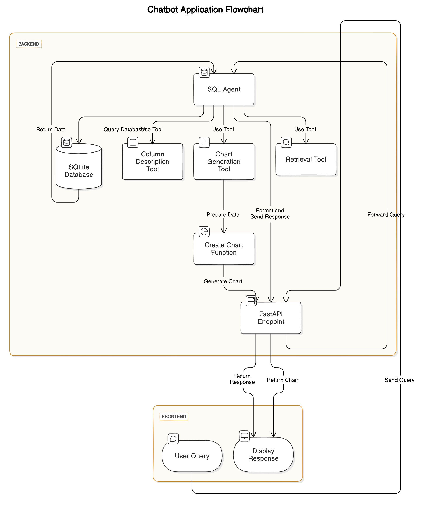

# Retail Insights Chatbot

## Overview

The Retail Insights Chatbot is an advanced AI-powered tool designed to provide in-depth analysis and insights from retail data. Utilizing natural language processing and SQL query generation, this chatbot allows users to interact with complex retail datasets through simple, conversational queries.

## Features

- Natural language query processing
- Advanced SQL query generation
- Data visualization with dynamic chart creation
- Few-shot learning for improved accuracy
- Multi-LLM support (OpenAI GPT and Google Gemini)
- Efficient data retrieval and caching

## Architecture

The application is built on a multi-layered architecture:

1. **API Layer:** FastAPI
2. **Agent Layer:** LangChain SQL Agent
3. **LLM Layer:** OpenAI GPT and Google Gemini
4. **Database Layer:** SQLite via SQLAlchemy
5. **Data Processing Layer:** Pandas
6. **Visualization Layer:** Matplotlib
7. **Few-Shot Learning Layer:** FAISS Vector Store



## Technologies Used

- FastAPI
- LangChain
- SQLAlchemy
- OpenAI GPT
- Google Gemini
- Pandas
- Matplotlib
- FAISS
- React Framework for Frontend

## Backend Setup and Installation

1. **Clone the repository:**
   ```bash
   git clone https://github.com/Maverick-RA/Noodify-AI.git
   ```

2. **Create and Activate virtual environment:**
   ```bash
   python -m venv venv
   source venv/bin/activate   # For Unix or MacOS
   venv\Scripts\activate      # For Windows
   python -m pip install --upgrade pip
   ```

3. **Install dependencies:**
   ```bash
   pip install -r requirements.txt #Navigate to backend directory
   ```

4. **Set up environment variables:**
   Create a `.env` file in the root directory and add your API keys:
   ```bash
   OPENAI_API_KEY="your_openai_api_key_here"
   TOOL_LLM_NAME="gpt-4o"
   AGENT_LLM_NAME="gpt-4o"
   DB_PATH="sqlite:///retail_data.db"
   # GOOGLE_API_KEY="your_google_api_key_here"  # Uncomment if using Google API
   ```

5. **Run the application:**
   ```bash
   python backend/run.py  # Be in the backend directory
   ```

## Frontend Installation Guide

### Node.js and npm:

1. **Ensure Node.js is Installed:**
   - Make sure Node.js is installed on your machine. You can download it from [https://nodejs.org/en](https://nodejs.org/en).
   - Note: npm (Node Package Manager) comes bundled with Node.js.

### Navigate to the Project Directory:

1. **Open your terminal or command prompt.**
2. **Change to the project directory:**
   ```bash
   cd frontend
   ```

### Install Dependencies:

1. **Run the following command to install the necessary dependencies in the project:**
   ```bash
   npm install
   ```

### Run the Development Server:

1. **Start the development server by running:**
   ```bash
   npm start
   ```

*Note:* This setup should authomatically connect the frontend to the backend when running locally.
## Contacts

For any questions on installation, please contact us at:
- simkrah2018@gmail.com (Data Analysis)
- frankkyeibaffour@gmail.com (Backend)
- gideongyimah19@gmail.com (frontend)
- chikafranciscachidimma@gmail.com (Data Analysis)

